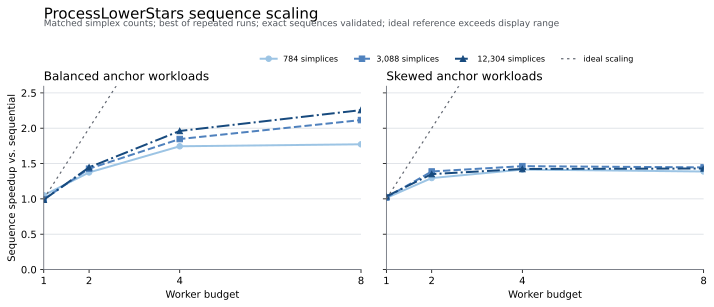
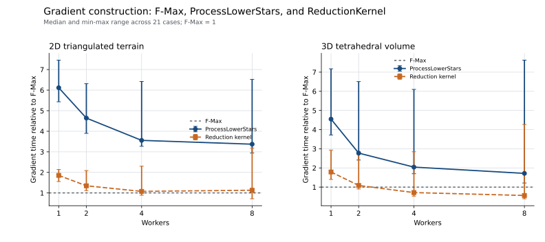
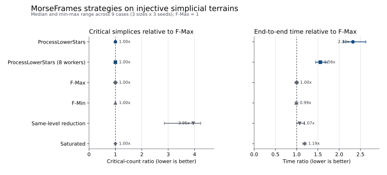
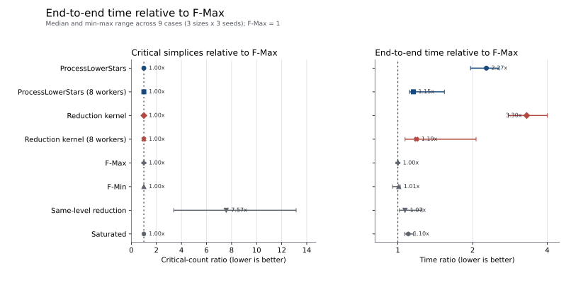
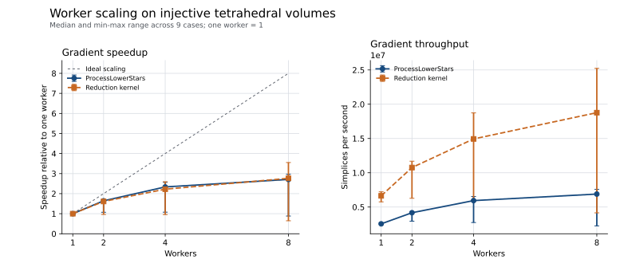
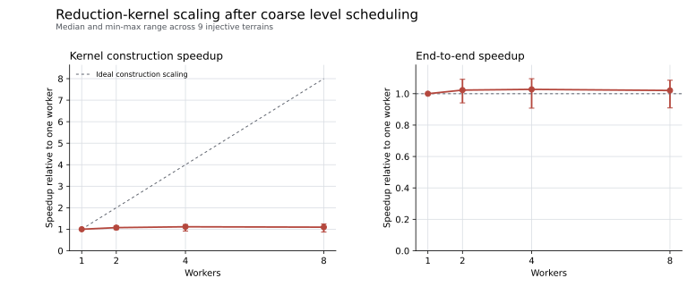

# Benchmark Reproduction

This page explains how to regenerate the public benchmark artifacts in this
repository. It is meant for software reproducibility: manuscript text and
discussion notes live outside the public repository, in the private manuscript
workspace until a public preprint or published version exists.

Run commands from the repository root.

```sh
cd morseframes
```

The examples below write raw CSV, Markdown summaries, and diagnostic prose to
`../work/`. The public repository tracks the scripts and selected LaTeX table
fragments, but not the manuscript prose built from them.

Some rendering commands below intentionally write tracked files under `docs/`.
Use those commands when you want to refresh the public table fragments. If you
only want to test the workflow on a local machine, redirect the table outputs to
`../work/` or restore the tracked table fragments afterward.

## Output Policy

Tracked public artifacts:

- `docs/*_table.tex`: LaTeX table fragments used to report benchmark results.
- `tools/*.py`: benchmark, validation, and table-rendering scripts.
- `benchmarks/benchmark_gudhi_view.cpp`: native GUDHI-view benchmark.

Local or private artifacts:

- `../work/*.csv`, `../work/*.md`, `../work/*.json`: raw benchmark outputs and
  summaries.
- `docs/*_prose.tex`: generated prose fragments. These are ignored by Git and
  should be copied into the private notes repository only when needed.
- report PDFs and manuscript drafts: private-note material, not public package
  documentation.

## Quick Validation

These checks are the fastest way to confirm that the source tree is usable.

```sh
MORSEFRAMES_DISABLE_CPP_BACKEND=1 \
  python3 -m unittest discover -s python/tests -p "test_*.py"

PYTHONPATH=python python3 python/examples/quickstart.py
PYTHONPATH=python python3 python/examples/prime_field_tutorial.py --modulus 3
```

To include the native C++ backend, install the package in editable mode:

```sh
python3 -m pip install -e ".[dev]"
python3 -c "import morseframes as mf; print(mf.__version__, mf.cpp_backend_available())"
```

The C++ smoke tests are:

```sh
cmake -S . -B build
cmake --build build
ctest --test-dir build --output-on-failure
```

## Synthetic Morse vs Standard Benchmarks

The main synthetic runner is `tools/benchmark_persistence.py`. It can run one
strategy, or the default strategy portfolio with `--sequence-algorithm
portfolio`.

Small smoke run:

```sh
mkdir -p ../work
PYTHONPATH=python python3 tools/benchmark_persistence.py \
  --preset smoke \
  --sequence-algorithm portfolio \
  --format summary \
  --output ../work/benchmark_smoke_summary.txt
```

Regenerate the public synthetic scale table:

```sh
mkdir -p ../work
PYTHONPATH=python python3 -c "import morseframes as mf; print(mf.cpp_backend_available())"

PYTHONPATH=python python3 tools/benchmark_persistence.py \
  --families lower-star plateau rips \
  --sizes 48 \
  --seeds 0 1 2 \
  --repeats 3 \
  --sequence-algorithm portfolio \
  --validation-mode core \
  --format csv \
  --output ../work/synthetic_scale_size48_portfolio.csv

PYTHONPATH=python python3 tools/render_synthetic_scale_table.py \
  --input ../work/synthetic_scale_size48_portfolio.csv \
  --table-output docs/synthetic_scale_table.tex \
  --prose-output ../work/synthetic_scale_prose.tex
```

The table reports `Std/Morse`, so values above `1` mean the Morse pipeline is
faster than ordinary full-complex persistence for that row.

CSV and JSON rows also retain gradient quality, rather than reporting timing
alone. The fields include the total critical count,
`critical_simplices_by_dimension`, `critical_ratio`, `num_regular_pairs`, and
`sequence_seconds_per_eliminated_simplex`. Timing is split into sequence and
downstream persistence phases, with `total_seconds` recording their complete
end-to-end pipeline. This makes comparisons between strategies meaningful even
when a faster constructor produces a larger Morse complex.

The tracked synthetic table is a native-backed core-mode benchmark. Before
replacing it, make sure the backend check above prints `True`; otherwise the CSV
will contain `cpp_backend=False` rows and the timing will describe the
pure-Python fallback instead of the optimized C++ backend.

## ProcessLowerStars Scaling

The focused ProcessLowerStars runner constructs two controlled simplicial
families. The balanced family gives every anchor vertex the same triangle-fan
workload. The skewed family keeps the same number of simplices but concentrates
most of that work in one lower star. All vertex values are injective and every
simplex uses the exact max-vertex lower-star extension.

```sh
PYTHONPATH=python python3 tools/benchmark_process_lower_stars.py \
  --anchors 16 \
  --balanced-fans 8 32 128 \
  --light-fan 2 \
  --workers 1 2 4 8 \
  --repeats 5 \
  --warmups 1 \
  --format csv \
  --output ../work/process_lower_stars_scaling.csv
```

For each scale, the heavy fan is selected automatically so both families have
the same total fan size and therefore the same simplex count. For example,
`16 * 8 = 98 + 15 * 2`. This isolates load imbalance from input size. Each
parallel row is checked against the sequential algorithm
for the exact Morse-step sequence and against ordinary persistence for the
barcode. The output records estimated task loads, critical counts by dimension,
construction and downstream persistence times, speedup, and parallel
efficiency. A `cpp_backend=False` row is a correctness run of the sequential
fallback, not a parallel-performance measurement.

The current controlled run on an Apple M1 Max (10 CPU cores), using five
measured repetitions after one warm-up, is shown below. At 12,304 simplices the
balanced case reaches 2.26x sequence speedup and 1.68x end-to-end speedup. The
matched skewed case reaches only 1.43x and 1.29x, respectively, while its
estimated eight-worker load ratio rises to 6.79. The two cases have identical
critical counts `(2048, 2032, 0)`, so this gap is attributable to scheduling
imbalance rather than a different Morse complex.



The exact paper-ready values are generated in
`docs/process_lower_stars_scaling_table.tex`. These measurements are a local
scheduler study, not yet the comparison with Robins' implementation; that
external benchmark remains a separate stage.

## Unified Gradient-Only Strategy Comparison

This is the central internal benchmark for discrete-gradient construction. It
compares F-Max, sequential and parallel ProcessLowerStars, and sequential and
parallel ReductionKernel on both triangulated 2D terrains and tetrahedral 3D
volumes. The timed path calls only `profile_morse_sequence`: it does not build a
reference map, a reduction plan, or a persistence diagram. Parallel sequences
are constructed once outside the timing loop and must agree exactly with their
sequential counterpart. Critical simplices are recorded by dimension and
compared with F-Max.

```sh
PYTHONPATH=python python3 tools/benchmark_gradient_strategies.py \
  --terrain-sizes 16 32 64 \
  --volume-sizes 4 8 12 16 \
  --seeds 0 1 2 \
  --workers 1 2 4 8 \
  --repeats 5 \
  --warmups 1 \
  --format csv \
  --output ../work/gradient_strategy_benchmark.csv

MPLCONFIGDIR=../work/matplotlib-cache \
  python3 tools/render_gradient_strategy_benchmark.py \
  --input ../work/gradient_strategy_benchmark.csv \
  --figure-output docs/gradient_strategy_comparison.svg \
  --table-output docs/gradient_strategy_comparison_table.tex
```

The run contains 21 complexes and 231 measured rows. All parallel gradients
match their sequential counterpart exactly, and all five approaches have zero
critical-count difference from F-Max in every case. In 2D, sequential
ProcessLowerStars and ReductionKernel take median times of 6.04 and 1.71 times
the F-Max time. At eight workers these ratios fall to 3.65 and 1.04, so the
parallel ReductionKernel is the faster of the two. In 3D, the corresponding
sequential ratios are 4.66 and 1.64; at eight workers they fall to 1.80 and
0.51. ReductionKernel is therefore the faster parallel method in both
dimensions and is faster than F-Max over the aggregate 3D corpus. At grid
sizes 12 and 16 it reaches 0.42 and 0.36 times the F-Max time, respectively.
ReductionKernel scales from one to eight workers by 1.57-fold in 2D and
3.25-fold in 3D, versus 1.65-fold and 2.58-fold for ProcessLowerStars. The
lower 2D ReductionKernel speedup reflects its substantially faster one-worker
implementation rather than a regression in eight-worker time.

The profiler times an uninstrumented construction and collects detailed phase
counters in a separate diagnostic run. This prevents high-frequency timing
calls inside ReductionKernel facet tasks from biasing the comparison. The
optimized kernel caches compact same-level face closures for triangular and
tetrahedral sections, reuses per-worker level scratch across filtration levels
and facet-discovery and result buffers across rounds, and stores the small
per-facet cells, removal masks, and events inline. Facet events are consumed
directly in deterministic order instead of rebuilding intermediate event
vectors. Per-level events are written into disjoint slices of one preallocated
arena, eliminating one allocation per filtration level without changing
reverse-per-level replay. Each event stores only its lower and upper simplex;
an invalid upper simplex denotes a perforation. The 16-byte events are
placement-constructed only when emitted, so unused arena capacity is neither
initialized nor read. Higher-dimensional cells transparently fall back to
dynamic storage. Relative to the preceding cached-closure implementation, the
median ReductionKernel/F-Max ratio falls from 5.51 to 3.04 sequentially in
2D and from 3.74 to 2.06 sequentially in 3D; the eight-worker 3D ratio falls
from 0.94 to 0.68.
Dynamic level claiming then lowers the eight-worker ratio from 1.89 to 1.33 in
2D and from 0.68 to 0.63 in 3D by eliminating level sorting and static
simplex-count partitions.
Reusing the level scratch owned by each worker subsequently lowers the
sequential ratios from 3.08 to 2.06 in 2D and from 2.14 to 1.81 in 3D. The
eight-worker ratios also fall from 1.33 to 1.31 and from 0.63 to 0.62,
respectively.
The shared event arena then lowers those eight-worker ratios from 1.31 to 1.13
in 2D and from 0.62 to 0.56 in 3D; the sequential ratios fall from 2.06 to 1.86
and from 1.81 to 1.74.
In a seven-repeat paired comparison against the initial 24-byte,
value-initialized arena, the compact uninitialized representation improves
median eight-worker time by 6.5 percent in 2D and 5.9 percent in 3D. Its
one-worker improvements are 1.3 and 2.8 percent, respectively.
The ordinary construction path now instantiates a compile-time metrics-free
kernel: clocks, diagnostic counters, per-facet diagnostic arrays, and the
per-level metrics vector remain available to the separate profiling run but
are absent from timed gradient construction. In a seven-repeat paired run over
all 105 ReductionKernel configurations, this lowers median time by 7.7 percent
and wins 89 comparisons. Median improvements are 7.7 percent sequentially and
15.2 percent at eight workers in 2D, and 5.9 and 6.4 percent, respectively, in
3D. The few regressions are concentrated in the smallest sub-millisecond cases.
Kernel-round merging is event-driven: only simplices named by accepted facet
reductions are visited and cleared, avoiding two full level-bucket passes per
round. Against the preceding topology-cache implementation, this reduces
median cached gradient time by 7.1 percent in 2D and 5.7 percent in 3D.
Sequential facet discovery also maintains an ordered compact list of active
simplices. Removed entries are discarded while discovering the next facets,
and the same list bounds incidence reset and low-dimensional cell construction.
In the initial seven-repeat comparison against event-driven merging alone,
cached median time falls by another 7.8 percent in 2D and 11.9 percent in 3D.
The metrics-free sequential path consumes each facet result immediately and
retains only its compact reduction events for the coordinator merge. Removing
the array of large intermediate facet-result objects lowers cached median time
by a further 4.9 percent in 2D and 7.7 percent in 3D.
Metrics-free facet results are separately specialized to contain only the
inline event buffer; diagnostic counters exist only in the instrumented type.
Across two confirmation runs this lowers default uncached median time by 3.2
percent in 2D and 4.7 percent in 3D, while cached time remains neutral in 2D
and improves by 1.9 percent in 3D.

### Reusable ReductionKernel Topology Cache

The owning `FilteredComplex` can explicitly precompute immutable same-level
closure ranges and coboundary adjacency for repeated sequential ReductionKernel
gradients. The focused benchmark constructs separate cached and uncached
copies, alternates their measurement order, verifies identical sequences, and
reports cache build time and memory separately:

```sh
PYTHONPATH=python python3 tools/benchmark_reduction_kernel_cache.py \
  --terrain-sizes 16 32 64 \
  --volume-sizes 4 8 12 16 \
  --seeds 0 1 2 \
  --repeats 11 \
  --warmups 2 \
  --output ../work/reduction_kernel_cache.csv
```

Across all 21 cases, every cached gradient exactly matches its uncached
counterpart and every cached run is faster. Median sequential speedup is
1.43-fold on terrains and 1.62-fold on tetrahedral volumes. Median cache build
costs are 0.23 ms and 1.45 ms, with median allocated footprints of 0.27 MiB and
1.65 MiB, respectively. The build cost is recovered after median counts of
1.57 terrain gradients and 1.34 volume gradients. The largest `n=16` volume
cache occupies 5.80 MiB. Multiworker ReductionKernel deliberately retains
worker-local topology construction because shared-cache access did not improve
its wall time.



The aggregate values are generated in
`docs/gradient_strategy_comparison_table.tex`; the raw CSV retains the exact
critical counts by dimension for every complex and worker count.

## Simplicial Strategy Comparison

The first internal comparison uses connected triangulated terrains rather than
independent synthetic lower stars. A smooth random field is sampled on each
grid, the vertices are strictly ranked, and every higher-dimensional simplex
receives the value of its maximum vertex. This gives an injective lower-star
filtration while retaining nontrivial terrain topology.

```sh
PYTHONPATH=python python3 tools/benchmark_simplicial_strategies.py \
  --sizes 16 32 64 \
  --seeds 0 1 2 \
  --parallel-workers 8 \
  --repeats 5 \
  --warmups 1 \
  --format csv \
  --output ../work/simplicial_strategy_benchmark.csv

MPLCONFIGDIR=../work/matplotlib-cache \
  python3 tools/render_simplicial_strategy_benchmark.py \
  --input ../work/simplicial_strategy_benchmark.csv \
  --figure-output docs/simplicial_strategy_comparison.svg \
  --table-output docs/simplicial_strategy_comparison_table.tex \
  --kernel-table-output docs/reduction_kernel_metrics_table.tex
```

Every measured Morse pipeline is checked against ordinary persistence for the
same barcode. The output records critical counts by dimension, regular-pair
counts, exact sequence agreement with ProcessLowerStars, and both construction
and end-to-end timings. Dedicated reduction-kernel fields record its levels,
rounds, facet kernels, reductions, perforations, parallel batches, concurrency,
and instrumented phase work. The phase durations are cumulative across tasks;
for a parallel row they are not wall-clock durations. Each reported case uses
the fastest of five measured runs after one warm-up.

The initial Apple M1 Max run covers nine cases (three sizes by three seeds).
ProcessLowerStars, reduction kernels, both eight-worker versions, F-Max, F-Min,
and Saturated produce the same critical count in every case. Same-level
reduction produces a median of 3.95 times as many critical simplices. Relative
to F-Max, median end-to-end time is 2.35 times as large for sequential
ProcessLowerStars and 2.39 times as large for sequential reduction kernels.
Eight-worker ProcessLowerStars improves to 1.29 times the F-Max time, while
the optimized eight-worker reduction kernel reaches 1.09 times the F-Max time.
The structural counters are unchanged: the runtime improvement comes from
coarse scheduling rather than a different Morse complex.



The grid-size aggregates are generated in
`docs/simplicial_strategy_comparison_table.tex`, and the reduction-kernel
operation and scheduling counters in `docs/reduction_kernel_metrics_table.tex`.
This is a MorseFrames-internal comparison; it does not replace the planned
external benchmark against Robins' ProcessLowerStars implementation.

## Tetrahedral Strategy Comparison

The three-dimensional companion uses a conforming Freudenthal triangulation:
each grid cube is split into the six tetrahedra defined by the permutations of
the coordinate axes. The same smooth-field ranking makes all vertex values
distinct, and the lower-star extension assigns every edge, triangle, and
tetrahedron the value of its maximum vertex. Sizes 4, 8, and 12 contain 883,
9,843, and 36,851 simplices, respectively, so they span approximately the same
range as the two-dimensional corpus.

```sh
PYTHONPATH=python python3 tools/benchmark_tetrahedral_strategies.py \
  --sizes 4 8 12 16 \
  --seeds 0 1 2 \
  --parallel-workers 8 \
  --repeats 5 \
  --warmups 1 \
  --format csv \
  --output ../work/tetrahedral_strategy_benchmark.csv

MPLCONFIGDIR=../work/matplotlib-cache \
  python3 tools/render_simplicial_strategy_benchmark.py \
  --input ../work/tetrahedral_strategy_benchmark.csv \
  --figure-output docs/tetrahedral_strategy_comparison.svg \
  --table-output docs/tetrahedral_strategy_comparison_table.tex \
  --kernel-table-output docs/tetrahedral_reduction_kernel_metrics_table.tex \
  --title "MorseFrames strategies on injective tetrahedral volumes"
```

The runner preserves the two-dimensional timing boundaries and correctness
checks. In particular, every strategy must reproduce the ordinary-persistence
barcode, while sequential and parallel versions of each new construction must
produce the same dimension-wise critical counts.

On the Apple M1 Max, the nine-case run finds identical critical counts for
ProcessLowerStars, reduction kernels, both eight-worker versions, F-Max, F-Min,
and Saturated. Same-level reduction creates a median of 7.57 times as many
critical simplices. Relative to F-Max, median end-to-end time is 2.27 times as
large for sequential ProcessLowerStars and 3.31 times as large for sequential
reduction kernels. The eight-worker versions reduce those ratios to 1.16 and
1.19, respectively. Parallel ProcessLowerStars is therefore slightly faster on
this rerun, although both remain close to the highly optimized sequential F-Max
path in three dimensions.



The grid-size aggregates are generated in
`docs/tetrahedral_strategy_comparison_table.tex`, with reduction-kernel counters
in `docs/tetrahedral_reduction_kernel_metrics_table.tex`.

## Tetrahedral Worker Scaling

The focused 3D scaling study times only discrete-gradient construction for the
parallel ProcessLowerStars and reduction-kernel implementations at one, two,
four, and eight workers. Each algorithm uses its own one-worker parallel
execution as the speedup baseline; every measured sequence is checked for exact
agreement with the corresponding sequential implementation. No reference map
or persistence computation is performed.

```sh
PYTHONPATH=python python3 tools/benchmark_tetrahedral_worker_scaling.py \
  --sizes 4 8 12 \
  --seeds 0 1 2 \
  --workers 1 2 4 8 \
  --repeats 5 \
  --warmups 1 \
  --format csv \
  --output ../work/tetrahedral_worker_scaling.csv

MPLCONFIGDIR=../work/matplotlib-cache \
  python3 tools/render_tetrahedral_worker_scaling.py \
  --input ../work/tetrahedral_worker_scaling.csv \
  --figure-output docs/tetrahedral_worker_scaling.svg \
  --table-output docs/tetrahedral_worker_scaling_table.tex
```

Across the nine cases, eight-worker ProcessLowerStars reaches a median
gradient-construction speedup of 2.61, versus 3.09 for the reduction kernel.
The corresponding median construction times are 1.39 ms and 0.45 ms, so the
optimized ReductionKernel is now faster in absolute time. Median eight-worker
efficiencies are 0.33 and 0.39, respectively.



The grid-size aggregates are generated in
`docs/tetrahedral_worker_scaling_table.tex`.

## Gradient-only Tetrahedral Phase Profile

This benchmark times only construction of the discrete gradient. It invokes
`FSequenceBuilder` with a no-op callback: no reference map, reduction plan, or
persistence computation occurs in the measured path. The native profiler
separates ProcessLowerStars into builder initialization, global lower-star
setup, local-star processing, and ordered event replay. It also records
critical-simplex counts by dimension and checks every parallel gradient against
the corresponding sequential result.

```sh
PYTHONPATH=python python3 tools/benchmark_tetrahedral_phase_profile.py \
  --sizes 4 8 12 16 \
  --seeds 0 1 2 \
  --workers 1 8 \
  --repeats 5 \
  --format csv \
  --output ../work/tetrahedral_phase_profile.csv

python3 tools/render_tetrahedral_phase_profile.py \
  --input ../work/tetrahedral_phase_profile.csv \
  --table-output docs/tetrahedral_phase_profile_table.tex
```

Across the twelve cases, eight-worker ProcessLowerStars reaches a 2.78-fold
gradient-construction speedup; ReductionKernel reaches 3.33-fold. Their median
eight-worker construction times are 3.22 ms and 0.90 ms, respectively. At
eight workers, ProcessLowerStars spends 34.4 percent in global setup, 37.0
percent in parallel local-star processing, 2.5 percent in ordered replay, and
4.9 percent in builder initialization. ReductionKernel spends 81.9 percent of
its diagnostic wall time processing levels; setup and replay account for 14.0
and 3.8 percent. The CSV now also records kernel rounds, facet kernels, facet
discovery scans, cached-cell visits, local candidate scans, coboundary scans,
membership tests, and inline-buffer overflows. All measured triangular and
tetrahedral kernels report zero inline-buffer overflows. For the `n=16`
volumes, the medians include roughly
458,000 local candidate visits but only 70,000 membership tests, confirming
that preserving the short-circuit local scan is preferable to eagerly building
all local incidences. These figures deliberately make no claim about
persistence performance.

The phase and concurrency aggregates are generated in
`docs/tetrahedral_phase_profile_table.tex`.

## Reduction-Kernel Scaling

The optimized parallel scheduler launches one long-lived task per worker. Each
task dynamically claims the next filtration level from an atomic counter,
avoiding both thousands of tiny executor tasks and the former sorting and
static simplex-count partition. Each task retains its facet flags, closure
tables, incidence counters, and result buffers between claimed levels. It
also writes into a preassigned slice of the shared event arena. It disables
nested facet tasks while multiple levels are running concurrently. A single
large plateau still uses the facet-parallel reduction-kernel path.

```sh
PYTHONPATH=python python3 tools/benchmark_reduction_kernel_scaling.py \
  --sizes 16 32 64 \
  --seeds 0 1 2 \
  --workers 1 2 4 8 \
  --repeats 5 \
  --warmups 1 \
  --format csv \
  --output ../work/reduction_kernel_scaling.csv

MPLCONFIGDIR=../work/matplotlib-cache \
  python3 tools/render_reduction_kernel_scaling.py \
  --input ../work/reduction_kernel_scaling.csv \
  --figure-output docs/reduction_kernel_scaling.svg \
  --table-output docs/reduction_kernel_scaling_table.tex
```

This older Python-level pipeline benchmark includes sequence-object
materialization, reference maps, and persistence, so it is retained only as an
overhead diagnostic rather than evidence for gradient speed. Across the nine
terrains, median native-sequence speedups are 1.05x, 1.11x, and 1.07x at two,
four, and eight workers; median end-to-end speedup is 1.02x at eight workers.
Every worker count is checked for the exact sequential reduction-kernel
sequence and the standard barcode. The gradient-only results above are the
relevant measurements for the present study.



The grid-size aggregates are generated in
`docs/reduction_kernel_scaling_table.tex`.

## Roadmap and External Data

The benchmark runner also has Roadmap and CAM-style families:

```text
cam-s4-rips
roadmap-rips
```

Roadmap datasets are cached under `../work/roadmap-data` by default. Missing
Roadmap files are not downloaded unless requested explicitly:

```sh
PYTHONPATH=python python3 tools/benchmark_persistence.py \
  --preset roadmap \
  --sequence-algorithm portfolio \
  --download-roadmap-data \
  --format csv \
  --output ../work/roadmap_portfolio.csv
```

Use this only when network access is acceptable.

## Native GUDHI-View Benchmark

The native GUDHI benchmark compares three in-process paths on the same
`Gudhi::Simplex_tree` input:

- `Direct`: MorseFrames through a read-only `Simplex_tree` view.
- `Import`: copy into the compact owning MorseFrames complex first.
- `GUDHI`: GUDHI persistent cohomology on the original `Simplex_tree`.

This benchmark is optional because it needs GUDHI and Boost headers. Configure
them explicitly when CMake cannot find them:

```sh
cmake -S . -B build-gudhi \
  -DMORSEFRAMES_GUDHI_INCLUDE_DIR=/path/to/gudhi/include \
  -DMORSEFRAMES_BOOST_INCLUDE_DIR=/path/to/boost/include

cmake --build build-gudhi --target morseframes_benchmark_gudhi_view
```

Quick run:

```sh
mkdir -p ../work
./build-gudhi/morseframes_benchmark_gudhi_view \
  --quick \
  --repeats 3 \
  > ../work/native_gudhi_view_quick.csv

PYTHONPATH=python python3 tools/render_native_gudhi_view_table.py \
  --input ../work/native_gudhi_view_quick.csv \
  --output docs/native_gudhi_view_quick_table.tex \
  --summary

PYTHONPATH=python python3 tools/render_native_gudhi_stage_profile.py \
  --input ../work/native_gudhi_view_quick.csv \
  --table-output docs/native_gudhi_stage_profile_quick_table.tex \
  --prose-output ../work/native_gudhi_stage_profile_quick_prose.tex \
  --summary
```

Default-size repeat run:

```sh
./build-gudhi/morseframes_benchmark_gudhi_view \
  --repeats 30 \
  > ../work/native_gudhi_view_default_r30.csv

PYTHONPATH=python python3 tools/render_native_gudhi_view_table.py \
  --input ../work/native_gudhi_view_default_r30.csv \
  --output docs/native_gudhi_view_default_r30_table.tex \
  --caption-title "Native \\texttt{Gudhi::Simplex\\_tree} default benchmark." \
  --label tab:native-gudhi-view-default-r30 \
  --summary
```

Larger lean run:

```sh
./build-gudhi/morseframes_benchmark_gudhi_view \
  --large \
  --lean \
  --repeats 30 \
  > ../work/native_gudhi_large_lean_r30.csv

PYTHONPATH=python python3 tools/render_native_gudhi_view_table.py \
  --input ../work/native_gudhi_large_lean_r30.csv \
  --output docs/native_gudhi_large_lean_r30_table.tex \
  --caption-title "Native \\texttt{Gudhi::Simplex\\_tree} larger lean benchmark." \
  --label tab:native-gudhi-large-lean-r30 \
  --summary
```

In these tables, `GUDHI/Direct < 1` means GUDHI is faster end-to-end, while
`GUDHI/Reducer > 1` means the Morse reducer kernel alone is faster than GUDHI
persistence after the Morse input has already been built.

## Prime-Field Overhead

Prime-field coefficient experiments are generated by
`tools/benchmark_prime_field_overhead.py`.

Quick local run:

```sh
mkdir -p ../work
PYTHONPATH=python python3 tools/benchmark_prime_field_overhead.py \
  --families lower-star plateau rips \
  --sizes 8 12 16 \
  --seeds 0 1 \
  --algorithms saturated f-max same-level-reduction \
  --primes 3 5 \
  --repeats 5 \
  --output-csv ../work/prime_field_overhead_quick.csv \
  --output-md ../work/prime_field_overhead_quick.md
```

Composite moduli are intentionally rejected by the barcode API; these reducers
work over fields `F_p`.

## Profile-Selection Validation

The profile-selection scripts compare cheap strategy-selection metrics against
measured portfolio timings. These runs are more expensive than the smoke tests.

Preview the commands without executing them:

```sh
PYTHONPATH=python python3 tools/run_fair_profile_validation.py \
  --validation-preset report \
  --dry-run
```

Regenerate the public validation table from fresh timings:

```sh
mkdir -p ../work
PYTHONPATH=python python3 tools/run_fair_profile_validation.py \
  --validation-preset report \
  --output-dir ../work \
  --table-output docs/profile_metric_fair_validation_table.tex \
  --prose-output ../work/profile_metric_fair_validation_prose.tex \
  --manifest-output ../work/fair_profile_validation_manifest.md
```

If CSVs already exist in `../work`, summaries can be regenerated without
rerunning timings:

```sh
PYTHONPATH=python python3 tools/run_fair_profile_validation.py \
  --validation-preset report \
  --output-dir ../work \
  --summaries-only \
  --table-output docs/profile_metric_fair_validation_table.tex \
  --prose-output ../work/profile_metric_fair_validation_prose.tex \
  --manifest-output ../work/fair_profile_validation_manifest.md
```

Selector decision and feature diagnostic tables are rendered from the validation
CSVs:

```sh
PYTHONPATH=python python3 tools/summarize_selector_decisions.py \
  --table-output ../work/profile_selector_decision_summary.txt \
  --csv-output ../work/profile_selector_decision_summary.csv \
  --latex-output docs/profile_selector_decision_summary_table.tex \
  --prose-output ../work/profile_selector_decision_summary_prose.tex

PYTHONPATH=python python3 tools/analyze_selector_features.py \
  --table-output ../work/selector_feature_diagnostic.txt \
  --csv-output ../work/selector_feature_diagnostic.csv \
  --json-output ../work/selector_feature_diagnostic.json \
  --latex-output docs/selector_feature_diagnostic_table.tex \
  --prose-output ../work/selector_feature_diagnostic_prose.tex
```

## Benchmark Summary Page

The visible compact tables in `docs/benchmark_summary.md` are generated from the
tracked LaTeX table fragments:

```sh
python3 tools/render_benchmark_summary.py
```

CI checks that this generated block is up to date:

```sh
python3 tools/render_benchmark_summary.py --check
```

## Before Committing Regenerated Results

Before committing regenerated table fragments, run:

```sh
git diff -- docs tools benchmarks
git diff --check
python3 tools/render_benchmark_summary.py --check
MORSEFRAMES_DISABLE_CPP_BACKEND=1 \
  python3 -m unittest discover -s python/tests -p "test_*.py"
```

Commit only public artifacts that are meant to be reproducible from this
repository. Keep manuscript text, discussion packages, generated prose, and PDFs
in the private notes repository.
