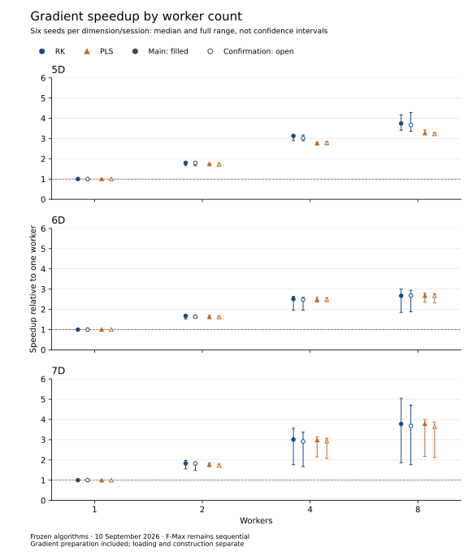

# Frozen RK / PLS / F-Max worker scaling

## Summary

**RK scales usefully, but large individual levels expose a repeatable limit.**
At eight workers, RK has lower paired median times than PLS on 17 of the 18
higher-dimensional inputs in both studies. Sixteen inputs have RK/PLS intervals
wholly below one in both studies; 7D seed 2 is inconclusive in confirmation,
and 7D seed 3 consistently favors PLS. Sequential F-Max remains faster than
sequential RK on all 18 higher-dimensional inputs.

This is a diagnostic pass, not a new optimization. All three algorithms,
construction, native data structures, scheduling, and timing boundaries are
frozen at `232d65069125b2fd3959f9eee16da32f8ef0a33a`. Only the benchmark
runner, validation, and documentation are added. The
[boundary-index study](rk_boundary_index_benchmark.md) remains the latest
algorithm change. TTK is **not rerun**; the
[PLS key-storage study](pls_key_arena_benchmark.md) remains the latest direct
TTK comparison on its documented earlier revisions.

## Scaling is seed-dependent

The corpus contains six injective vertex-order seeds (0–5) for each of
5D/side 3, 6D/side 2, and 7D/side 2 Freudenthal grids, plus six 4D/volume
controls. The geometry is fixed within each dimension: these seeds vary the
function, not the triangulation. In particular, the 6D/7D grids have only
one hypercube before triangulation; this is not a representative high-dimensional
data corpus or a monotonic size sweep across dimensions.

Start with the same finalized native complex resident. Include the fresh
builder, every algorithm-specific preparation step, pools and worker startup,
local work, replay, and natural in-method cleanup. Returned builders/gradients
remain alive at the stop. Loading and construction are reported separately;
there is no persistence or untimed algorithm-specific cache.

RK's eight-worker speedups over its own sequential execution range from
**3.35–4.29× in 5D, 1.85–3.00× in 6D, and 1.76–5.04× in 7D**, over all
six seeds in both sessions. These are ranges of paired point estimates,
not confidence intervals. F-Max remains sequential at every worker setting.



The figure shows medians and full seed ranges separately for main and
confirmation. It makes the broad 7D spread visible; a single average would
hide the difficult seed. Error bars show variation across seeds, not
uncertainty of a pooled estimate. No interpolation between worker counts is
implied. [Exact seed-level times, intervals, phases, and counts](rk_worker_scaling_tables.md)
are retained in the numerical appendix.

The following compact lookup table uses the median of six seed-specific
median gradient times (milliseconds). Do not form paired ratios from these
cross-seed summary times.

| Study | D | RK 1 | RK 2 | RK 4 | RK 8 | PLS 8 | F-Max (seq.) |
| --- | --- | --- | --- | --- | --- | --- | --- |
| Main | 5D | 10.108 | 5.624 | 3.296 | 2.681 | 4.412 | 5.228 |
| Confirmation | 5D | 10.083 | 5.697 | 3.267 | 2.677 | 4.408 | 5.171 |
| Main | 6D | 3.322 | 1.988 | 1.311 | 1.208 | 1.811 | 1.602 |
| Confirmation | 6D | 3.218 | 1.944 | 1.295 | 1.206 | 1.753 | 1.585 |
| Main | 7D | 57.294 | 30.887 | 18.522 | 14.722 | 17.724 | 28.116 |
| Confirmation | 7D | 57.003 | 31.806 | 19.532 | 15.453 | 17.786 | 25.829 |

RK beats PLS on all six 5D and all six 6D seeds at **every tested worker
count**, with intervals wholly below one in both studies. Sequential RK also
beats sequential PLS on all six 7D seeds. But sequential RK takes about
1.81–2.60 times as long as sequential F-Max across these 18 inputs. At eight
workers RK has lower paired medians than sequential F-Max on 16 inputs in
both studies, with intervals wholly below one on 15 in both. The 6D seed-1
confirmation is inconclusive: 0.716 [0.663, 1.199]. The 6D seed-4 and
7D seed-3 comparisons still favor F-Max in both studies.

## The 7D exception survives reversed measurement order

Eight-worker RK/PLS ratios below one favor RK. Brackets are 95% paired-block
bootstrap intervals within the individual study, not across-machine intervals.

| 7D seed | Main RK/PLS [interval] | Confirmation RK/PLS [interval] |
| --- | --- | --- |
| 0 | 0.798 [0.754, 0.811] | 0.789 [0.781, 0.839] |
| 1 | 0.665 [0.653, 0.683] | 0.662 [0.648, 0.677] |
| 2 | 0.894 [0.882, 0.906] | 0.917 [0.904, 1.007] |
| 3 | 1.111 [1.093, 1.140] | 1.170 [1.129, 1.210] |
| 4 | 0.632 [0.618, 0.657] | 0.636 [0.624, 0.656] |
| 5 | 0.800 [0.791, 0.824] | 0.787 [0.751, 0.806] |

For seed 3, RK takes 37.189/36.849 ms at eight workers, versus PLS
33.880/31.517 ms and sequential F-Max 28.559/24.677 ms (main/confirmation).
PLS also wins against RK at two and four workers on this seed in both runs.
The median RK speedup reaches only 1.86×/1.76× at eight workers.
The result rules out a general “RK is fastest in 7D” claim.

6D seed 4 provides another repeatable scaling limitation: its RK medians are
1.832/1.713 ms at four workers and 1.945/1.810 ms at eight. Those are median
reversals, not a separate claim of statistically established eight-versus-four
slowdown. The one-versus-eight speedup remains positive.

## Worker imbalance is a stronger lead than global setup

The existing coarse metrics measure the elapsed lifetime of each persistent
level-worker task. They include that task's sequence of level computations
and scheduling overhead, not CPU time or individual-level durations. Their
sum overlaps in wall time; it cannot be added to global elapsed time.

For 7D seed 3 at eight workers, the minimum/maximum task lifetimes are
4.553/35.210 ms in main and 4.235/35.118 ms in confirmation. The lifetime
balance indicator `sum(lifetimes)/(8 × maximum lifetime)` is 0.279/0.277.
For comparison, 7D seed 1 has 0.915/0.933, and seed 4 has 0.908/0.923.
These are descriptive balance indicators, **not CPU utilization or measured
parallel efficiency**.

One lower star in 7D seed 3 contains 69,072 of 189,171 simplices (36.5%).
Its owner is input vertex 0, with filtration rank 116 out of ranks 0–127.
The metadata's lower-star size array is indexed by vertex ID, not filtration
rank. In 6D seed 4, vertex 0 at rank 53 owns 5,274 of 18,731 simplices
(28.2%); its eight-worker lifetime balance is 0.387/0.417. Counts alone are
not a cost model, but these observations support investigating the large
levels rather than assuming an entirely uniform workload.

The coarse profile of 7D seed 3 locates almost all elapsed time inside level
processing, not builder/global workspace setup or replay:

| RK phase, 7D seed 3, eight workers | Main (ms) | Confirmation (ms) |
| --- | --- | --- |
| Builder | 0.146 | 0.143 |
| Workspace/pool setup | 0.242 | 0.240 |
| Level processing | 35.244 | 35.194 |
| Replay | 0.313 | 0.353 |
| Unattributed remainder | 0.683 | 0.827 |
| Total profiled gradient | 36.789 | 36.631 |

These are separate instrumented calls. Marginal medians need not sum exactly.
Importantly, **level processing includes per-level preparation**, including
boundary-index/closure construction; a small global setup timer does not
mean all preparation is cheap. Detailed nested timers remain in the raw
evidence and must not be treated as additive global wall-time phases.

The current scheduler dynamically claims levels; at four/eight workers its
chunk size is already one on these 5D–7D inputs. Nested facet tasks are
disabled while multiple level workers run, while single-level execution can
use intra-level parallelism. Smaller level chunks therefore cannot by themselves
split a dominant level. The profiles do not tell us which individual level
causes the longest task, how late it starts, or how much a different schedule
or within-level split would save. Core heterogeneity and contention are not
excluded as contributing factors.

## Regression controls remain inconclusive, not discarded

Separate A/B controls compare the pre-index baseline `a0665429` against
the frozen current implementation on volume16, volume32, and 4D, seeds 0/2,
at one/eight workers. Both main and reversed confirmation retain all cases.
No control interval is wholly above one in either run. Nevertheless:

- Volume32 seed 0, one worker, has slower paired medians in both studies:
  1.056 [0.994, 1.146] and 1.041 [0.974, 1.072]. Unchanged PLS medians also
  rise, which is compatible with context effects but does not prove a cause.
- 4D seed 0, eight workers, is also slower by median in both studies:
  1.089 [0.955, 1.129] and 1.035 [0.978, 1.282].
- The earlier large 4D seed-2/eight-worker slowdown does not repeat:
  0.943 [0.815, 1.069] and 0.909 [0.808, 1.139]. Volume32 seed 2, one
  worker, gives 0.987 [0.958, 1.011] and 0.991 [0.966, 1.049].

These results do not justify a no-regression claim or erase previous
observations. The [full control table](rk_worker_scaling_tables.md#repeated-boundary-index-regression-controls)
also retains the isolated gains, mixed signs, and wide intervals.

## Protocol, correctness, and limits

The [measurement protocol](rk_worker_scaling_protocol.md) was committed before
the final runs, together with runner/tests, at `16d976b`. Each scaling study
uses 24 inputs × four worker counts × eight blocks × six repetitions of all
three methods: 13,824 unprofiled gradient calls. Each block contains every
worker count and all six method orders. Worker positions and relative pair
order are balanced; confirmation reverses input order and each block's
worker order. There are two initial warmups per count and three separate
PLS/coarse-RK/detailed-RK profiles per count. The smaller control studies use
six paired blocks of two repetitions, with balanced version/method order.

All measurements ran on 10 September 2026, Apple M1 Max, 64 GiB RAM,
eight performance plus two efficiency cores, native ARM64, Apple Clang 15,
`-std=c++17 -O3 -DNDEBUG -pthread`. Main scaling: 16:23:40–16:29:22 UTC;
confirmation: 16:29:42–16:35:24 UTC. Control studies: 16:35:40–16:36:53 and
16:36:53–16:38:07 UTC. No concurrent builds, tests, or other benchmark jobs
were launched during measurements. This was an interactive desktop with
other applications active, not an isolated performance lab.

Paired-block bootstrap intervals describe within-session variation and are
not adjusted for multiple comparisons. Repeated same-machine studies are
robustness checks, not independent-machine replications. Sequential F-Max
also varies with measurement context: paired worker-setting/one-worker
medians range roughly 0.910–1.089 across the higher-dimensional corpus.
Do not call this F-Max scaling, or divide RK results by it as a noise correction.

All raw audits pass: complete coverage/order, phase accounting, immutable RK
work counts, source/header/input hashes, recomputed summaries, and exact
ordered reference-dump hashes across studies. Every native timed/profiled
run checks its ordered-gradient fingerprint against its validated sequential
reference. No equality of different methods' gradients is assumed.

Critical counts by dimension are identical across worker counts and sessions
within each method. All three methods agree on 23 of the 24 inputs; the
existing 4D seed-0 difference remains: F-Max `[19, 46, 43, 16, 1]`,
PLS/RK `[19, 46, 42, 15, 1]`. Every vector and each input's separate
construction/loading observation is in the [numerical appendix](rk_worker_scaling_tables.md).

The assertion-enabled C++ suite passes. Native Python tests have 169 passes
and four optional resident-benchmark skips; the fallback suite runs 173 tests
with 14 skips. Five new runner unit tests check order balance, invalid
schedules, ratio direction, paired aggregation, and malformed timings.
Sphinx builds with warnings treated as errors (apart from existing dependency
deprecation notices). Independent raw headline checks and rendered-table QA
validate 18 main-report rows and 660 appendix rows; the figure and summary
table were also inspected in the rendered documentation. The local QA
companion is `../validate_rk_scaling_report.py`.

Validation assessment: **share with caveats**. The evidence supports useful
parallel scaling and repeatable task imbalance, not a universal fastest
algorithm or a proved explanation of individual-level costs. Memory use,
non-injective/plateau performance, other triangulations, other machines, and
new TTK measurements remain outside this study.

## Next experiment

Add a bounded per-level timing/assignment diagnostic, especially for 7D seed 3
and 6D seed 4, then test whether earlier scheduling of heavy levels or selective
within-level parallelism reduces the long tail. Measure any diagnostic overhead
separately and keep it out of headline timings. Preserve deterministic gradients
and bounded worker counts. This study supports that investigation; it does not
authorize or implement a scheduler change yet.

The open question is how much of the long task can be shortened by ordering
alone, versus splitting expensive preparation or facet work within a level.
Global setup and native construction are not the next target for this
gradient-only investigation.

## Reproduction and raw evidence

Reuse the documented volume/4D control inputs. Generate the additional
5D–7D inputs with `grid_input(dimension, side, seed)` from
`tools/benchmark_simplicial_gradients.py`, for `(5,3)`, `(6,2)`, `(7,2)` and
seeds `range(6)`, saving the deterministic text to
`../higher-dimensional-inputs/grid-dDIM-nSIDE-seedSEED.txt`. Existing files
must match exactly; do not overwrite conflicting evidence.

```bash
LC_ALL=C OMP_WAIT_POLICY=PASSIVE python tools/benchmark_simplicial_worker_scaling.py \
  --revision 232d65069125b2fd3959f9eee16da32f8ef0a33a \
  --inputs ../rk-ab-inputs/volume-n{16,32}-seed{0,2}.txt \
  ../higher-dimensional-inputs/grid-d4-n4-seed{0,2}.txt \
  ../higher-dimensional-inputs/grid-d5-n3-seed{0..5}.txt \
  ../higher-dimensional-inputs/grid-d6-n2-seed{0..5}.txt \
  ../higher-dimensional-inputs/grid-d7-n2-seed{0..5}.txt \
  --output ../FRESH-main.json
# Repeat with --reverse and a different --output.

LC_ALL=C OMP_WAIT_POLICY=PASSIVE python tools/benchmark_simplicial_gradients.py \
  --baseline a0665429b6245e7803cc5dbac6cb37b63148a75f \
  --candidate 232d65069125b2fd3959f9eee16da32f8ef0a33a \
  --inputs ../rk-ab-inputs/volume-n{16,32}-seed{0,2}.txt \
  ../higher-dimensional-inputs/grid-d4-n4-seed{0,2}.txt \
  --workers 1 8 --blocks 6 --repeats 2 --warmups 2 --profiles 3 \
  --rk-profiles 3 --memory-repeats 0 --output ../FRESH-controls-main.json
# Repeat with --workers 8 1 --reverse-inputs and a different --output.

python tools/benchmark_simplicial_worker_scaling.py --audit \
  ../rk-worker-scaling-main.json ../rk-worker-scaling-confirmation.json
python tools/validate_simplicial_gradient_ab.py --reversed-confirmation \
  ../rk-worker-scaling-controls-main.json ../rk-worker-scaling-controls-confirmation.json
python tools/render_rk_worker_scaling.py --check
```

Raw artifacts are retained outside the repository; SHA-256:

- `rk-worker-scaling-main.json`:
  `e6871f5660fb1927de8c2074374daaca6d8c84b6055f7c8c9dee9348f8a889fc`
- `rk-worker-scaling-confirmation.json`:
  `9622672ef8950a201546e5854899eecfe7fcd5b2af28671867e2e01af1f9f61d`
- `rk-worker-scaling-controls-main.json`:
  `4504a63f7521e81d3190a195192eb458e071e8ba70aa45b74ddfb2deb314deab`
- `rk-worker-scaling-controls-confirmation.json`:
  `4d68f0236a749e6cad9b82b4ed8e1dc3b16915b5c8430a083068f5b844f45f27`

The separate `rk-worker-scaling-smoke.json` validates the runner only and is
excluded from all performance claims. The report figure and full tables are
regenerated by `tools/render_rk_worker_scaling.py`; native algorithms are unchanged.
